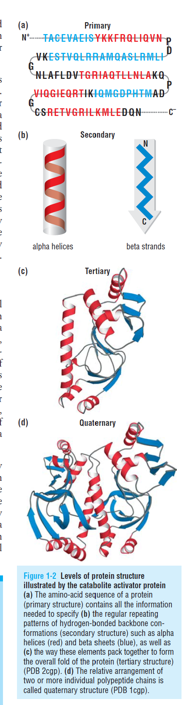

# Introduction

## Proteins Overview
- essential macronutrients used by the body to provide neccessary biological functions for life
- Made up of 20 amino acids, that determine it's 3D structure which is closely tied to that protein's function
    - Amino Acid -> Protein Sequence -> Protein 3D Structure -> Protein Function
- Protein Structure
    - Primary Structure - Sequence of Amino Acids (mental picture: a long ribbon)
    - Secondary Structure - How the Primary structure folds, twists, bends, or zig-zags (mental picture: that long ribbon twisting and turning)
        - Alpha Helices ($\alpha$-<b>helices</b>)
        - Beta Sheets ($\beta$-<b>sheets</b>)
    - Tertiary Structure - The complete 3D shape of amino acid chains (polypeptides)
        - $\alpha$-helices and $\beta$-sheets packed together
    - Quaternary Structure (optional: not all proteins have this structure)

<I>A common way to describe the structure of a protein is to divide it into two separate components–the backbone and the sidechains that extend from it. The protein backbone is a linear chain of nitrogen, carbon, and oxygen atoms. The torsional angles ($\Phi$, $\Psi$, and $\Omega$) that connect these atoms form the overall shape of the protein. In contrast, protein sidechains are chemical groups of zero to ten heavy atoms connected to the central α-carbon of each amino acid residue. Each of the twenty distinct amino acids is defined by the unique structure and chemical composition of its sidechain component. Consequently, each protein is defined by the unique sequence of its constituent amino acids. The precise orientation of amino acid sidechains is critical to the biochemical function of proteins. Enzyme catalysis, drug binding, and protein-protein interactions all depend on a level of atomic precision that is not accounted for in backbone structure alone. Thus, the protein backbone and sidechain are both crucially important to protein structure and function.</I> - [King, Koes (2022)](https://pmc.ncbi.nlm.nih.gov/articles/PMC8492522/)

## ML/DL Tasks
- the scn_load function will download the dataset (if slow you directly download the dataset from here: [http://bits.csb.pitt.edu/~jok120/sidechainnet_data/sidechainnet_casp12_30.pkl](http://bits.csb.pitt.edu/~jok120/sidechainnet_data/sidechainnet_casp12_30.pkl)) (3.36GB)
    - create a folder named 'data' where the final_project.ipynb is located and put the 'casp12_30.pk1' file in that folder

- Baseline model: BiLSTM (Bi-Directional LSTM)
    - [https://keras.io/api/layers/recurrent_layers/bidirectional/](https://keras.io/api/layers/recurrent_layers/bidirectional/)

### Goal
    - Predict 'angles' from the sequence

## Dataset Information
### SidechainNet 
- SidechainNet dataset comes in a pickle file that is dictionary with a train, test and validation sets
- validation sets: valid-10, valid-20, valid-30, valid-40, valid-50, valid-70, valid-90
    - values define how similar the proteins are in comparision to the train set, valid-10 being only 10% similar and valid-90 being 90% similar => valid-10 is the hardest val set and valid-90 is the easiet
- Input variables for each protein in the dataset
    - seq: amino acid sequence of the protein
    - evo: evolutionary information (position-specific scoring matrix) for the protein sequence, describes how each position in the sequence is conserved across different species
    - msk: used to pad the sequences to a fixed length since sequences can have varying lengths, indicates which positions in the sequence are valid (1) and which are padding (0)

- Target variables for each protein in the dataset
    - ang: 3D coordinates of the protein backbone and sidechain atoms
    - crd: 3D coordinates of the protein backbone atoms (N, CA, C)
    - sec: secondary structure information for the protein sequence

- Metadata variables for each protein in the dataset
    - ids: unique identifier for the protein from the Protein Data Bank (PDB)
    - res: resolution of the protein structure (in Angstroms), lower means higher quality structure
    - ums: unmodified sequence of the protein (original sequence without any modifications or padding)
    - mod: modified sequence of the protein (sequence with modifications or padding applied)

### ProteinNet (Precursor to SidechainNet)
- Standardized dataset for ML of Protein Structures
- Provides training models a map of protein sequences to their 3D structure
- Created from the <I>Critical Assessment of protein Structure Prediction (CASP)</I> dataset: [https://predictioncenter.org/](https://predictioncenter.org/)

## Amino Acid Abbreviations

| Amino Acid | 3-Letter | 1-Letter |
| :--- | :--- | :--- |
| Alanine | Ala | A |
| Arginine | Arg | R |
| Asparagine | Asn | N |
| Aspartic Acid | Asp | D |
| Cysteine | Cys | C |
| Glutamine | Gln | Q |
| Glutamic Acid | Glu | E |
| Glycine | Gly | G |
| Histidine | His | H |
| Isoleucine | Ile | I |
| Leucine | Leu | L |
| Lysine | Lys | K |
| Methionine | Met | M |
| Phenylalanine | Phe | F |
| Proline | Pro | P |
| Serine | Ser | S |
| Threonine | Thr | T |
| Tryptophan | Trp | W |
| Tyrosine | Tyr | Y |
| Valine | Val | V |